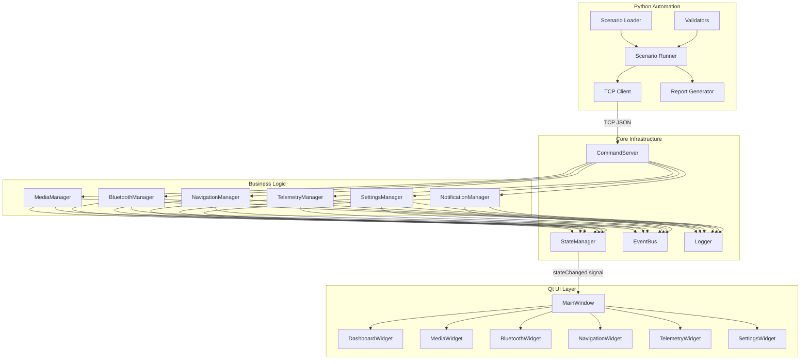

# Architecture

## System Overview

The infotainment simulator follows a layered architecture with clear separation between UI, business logic, and automation interface.

## Data Flow

1. **Command Input**: TCP JSON commands arrive at `CommandServer`
2. **Validation**: `InputValidator` checks structure, types, and ranges
3. **Routing**: `CommandServer` routes to the appropriate manager
4. **Business Logic**: Manager validates state transitions, executes logic
5. **State Update**: Manager updates `StateManager`
6. **Event Publishing**: Manager publishes event to `EventBus`
7. **Logging**: Manager logs state transition via `Logger`
8. **UI Update**: `StateManager` emits `stateChanged()` signal → UI widgets update
9. **Response**: `CommandServer` returns JSON response with current state

## Component Responsibilities

| Component | Responsibility |
|---|---|
| StateManager | Single source of truth for application state |
| EventBus | Decoupled publish/subscribe event routing |
| Logger | Structured JSON Lines logging to file + memory |
| CommandServer | TCP JSON interface for automation |
| InputValidator | Command structure and parameter validation |
| MediaManager | Media playback state machine |
| BluetoothManager | BT connection + call handling |
| NavigationManager | Navigation alerts with priority rules |
| TelemetryManager | Vehicle telemetry with range validation |
| SettingsManager | Key-value settings storage |
| NotificationManager | Priority-based notification queue |

## Design Decisions

- **Constructor injection**: All managers receive dependencies via constructors (no singletons)
- **Thread safety**: StateManager and EventBus use `std::mutex` for thread-safe access
- **Qt signals**: StateManager emits `stateChanged()` for reactive UI updates
- **Exception safety**: EventBus catches handler exceptions to prevent cascade failures
- **Separation**: Business logic has zero knowledge of UI; UI only reads state
