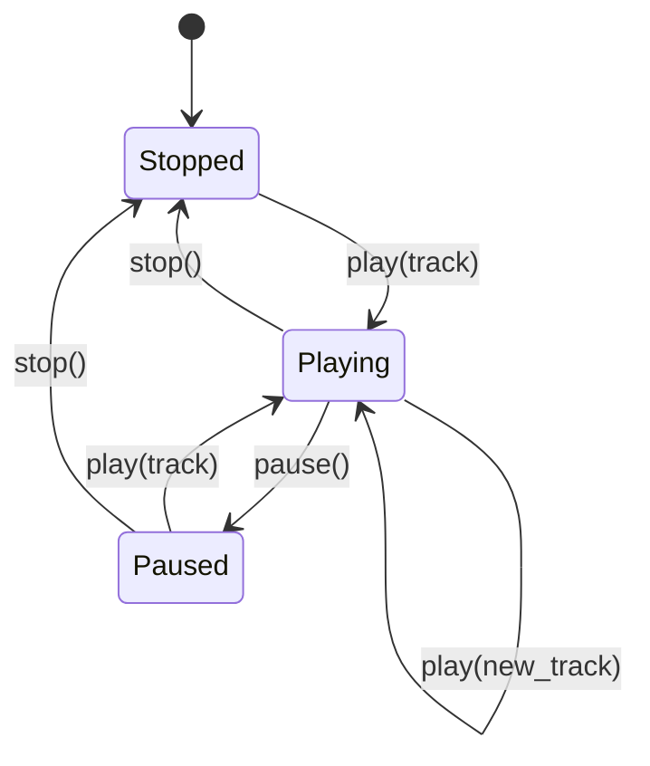
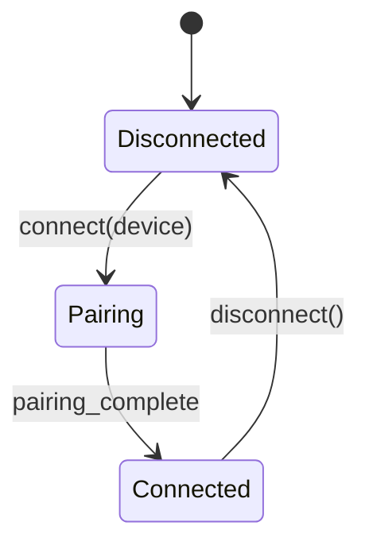
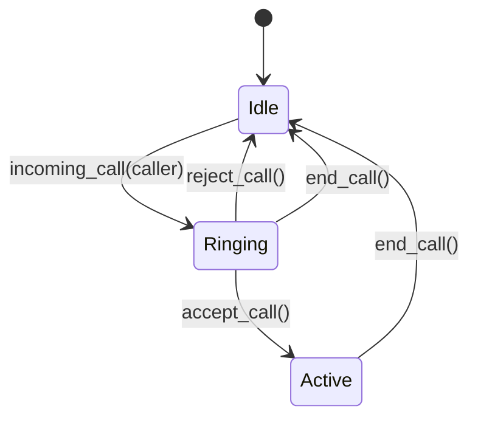
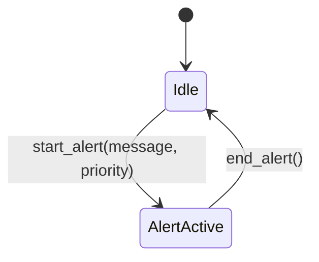
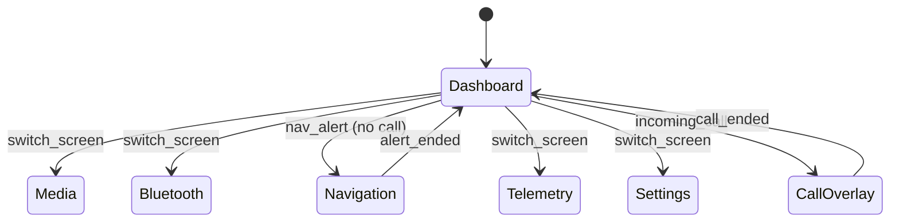

# State Machines

## Media State Machine

**Rules:**
- Volume: 0–100 (validated)
- Track name required for play
- Cannot pause when stopped
- Cannot stop when already stopped

## Bluetooth State Machine

**Rules:**
- Cannot connect while already connected
- Disconnect ends any active call
- Device name required for connect

## Call State Machine

**Rules:**
- Requires Bluetooth connected
- Incoming call auto-pauses playing media
- Incoming call switches screen to CallOverlay
- Cannot receive call during active call
- Reject/end returns screen to Dashboard

## Navigation State Machine

**Rules:**
- Alert does NOT override CallOverlay screen
- Message and priority required
- End alert returns screen to Dashboard (if currently on Navigation)

## Screen Priority

**Priority Order (highest to lowest):**
1. CallOverlay (incoming/active call)
2. Navigation (active alert, only when no call)
3. User-selected screen
4. Dashboard (default)
